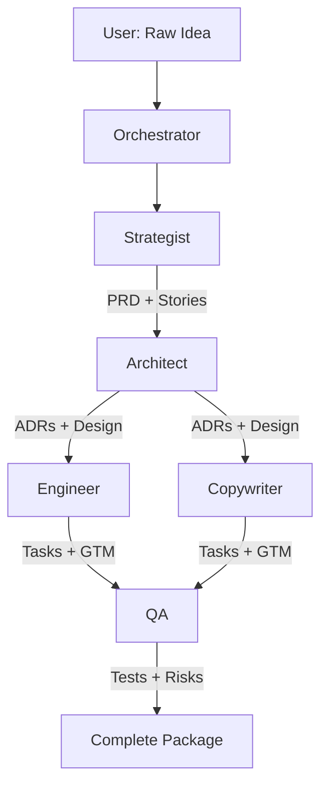

# SpecForge

<div align="center">


**Transform ideas into complete product packages in minutes**

[](https://wildhash.github.io/specforge)
[](https://nextjs.org/)
[](https://www.typescriptlang.org/)
[](LICENSE)

</div>

## 🚀 What is SpecForge?

SpecForge is a **self-assembling AI product specification engine** that orchestrates 6 specialized agents in a DAG pipeline to transform your raw product idea into a complete, production-ready package.

### 🤖 Your AI Agent Team

- **Strategist** — PRD, Personas, User Stories
- **Architect** — ADRs, System Design, Tech Specs
- **Engineer** — Task Breakdown, Code Scaffolding
- **Copywriter** — GTM Strategy, Pitch Deck
- **QA Sentinel** — Test Plans, Risk Register
- **Orchestrator** — DAG Execution, Self-Assembly

## ✨ Features

- 🎯 **One-Click Generation** — Submit an idea, get a complete product package
- 🔄 **DAG Orchestration** — Parallel agent execution with dependency management
- 📦 **Complete Artifacts** — PRD, ADRs, design specs, tasks, GTM, pitch deck, tests
- 🎨 **Beautiful UI** — Modern, responsive design with real-time progress tracking
- 🧪 **Fully Tested** — Unit, integration, and E2E test coverage
- 🚢 **Production Ready** — TypeScript, Next.js 14, Tailwind CSS

## 🎭 Live Demo

Experience SpecForge in action: **[wildhash.github.io/specforge](https://wildhash.github.io/specforge)**

The demo runs in simulation mode with mock data to showcase the UI and workflow.

## 🛠️ Tech Stack

- **Framework**: Next.js 14 with App Router
- **Language**: TypeScript 5.4
- **Styling**: Tailwind CSS 3.4
- **Validation**: Zod 3.23
- **Testing**: Vitest 1.6 + Coverage
- **CI/CD**: GitHub Actions

## 🏗️ Architecture



## 🚀 Getting Started

### Prerequisites

- Node.js 20+
- npm or yarn

### Installation

```bash
# Clone the repository
git clone https://github.com/wildhash/specforge.git
cd specforge

# Install dependencies
npm install

# Copy environment template
cp env.example .env.local

# Start development server
npm run dev
```

Visit [http://localhost:3000](http://localhost:3000) to see the app.

### Build for Production

```bash
# Build the app
npm run build

# Start production server
npm start
```

### Build for Static Export (GitHub Pages)

```bash
# Build static site with demo mode
npm run build:export

# The static files will be in the `out/` directory
```

## 📁 Project Structure

```
specforge/
├── src/
│   ├── app/              # Next.js app router pages
│   ├── components/       # React components
│   ├── core/            # Core orchestration logic
│   ├── lib/             # Utilities and helpers
│   └── actions/         # Server actions
├── .github/
│   └── workflows/       # CI/CD workflows
└── public/              # Static assets
```

## 🧪 Testing

```bash
# Run all tests
npm test

# Run tests in watch mode
npm run test:watch

# Generate coverage report
npm run test:coverage

# Run E2E tests
npm run test:e2e
```

## 📚 Documentation

- **[Product Requirements](specforge-prd.md)** — Complete PRD
- **[Architecture ADRs](specforge-architecture-adr.md)** — Technical decisions
- **[Design Specification](specforge-design-spec.md)** — System design
- **[Implementation Plan](specforge-implementation-plan.md)** — Development roadmap
- **[GTM Strategy](specforge-gtm-strategy.md)** — Go-to-market plan

## 🤝 Contributing

Contributions are welcome! Please feel free to submit a Pull Request.

1. Fork the repository
2. Create your feature branch (`git checkout -b feature/amazing-feature`)
3. Commit your changes (`git commit -m 'Add some amazing feature'`)
4. Push to the branch (`git push origin feature/amazing-feature`)
5. Open a Pull Request

## 📄 License

This project is licensed under the MIT License - see the [LICENSE](LICENSE) file for details.

## 🙏 Acknowledgments

Built with ❤️ using:
- [Next.js](https://nextjs.org/)
- [React](https://react.dev/)
- [Tailwind CSS](https://tailwindcss.com/)
- [Zod](https://zod.dev/)
- [Vitest](https://vitest.dev/)

## 📧 Contact

- GitHub: [@wildhash](https://github.com/wildhash)
- Project Link: [https://github.com/wildhash/specforge](https://github.com/wildhash/specforge)

---

<div align="center">
Made with 🚀 by the SpecForge community
</div>
