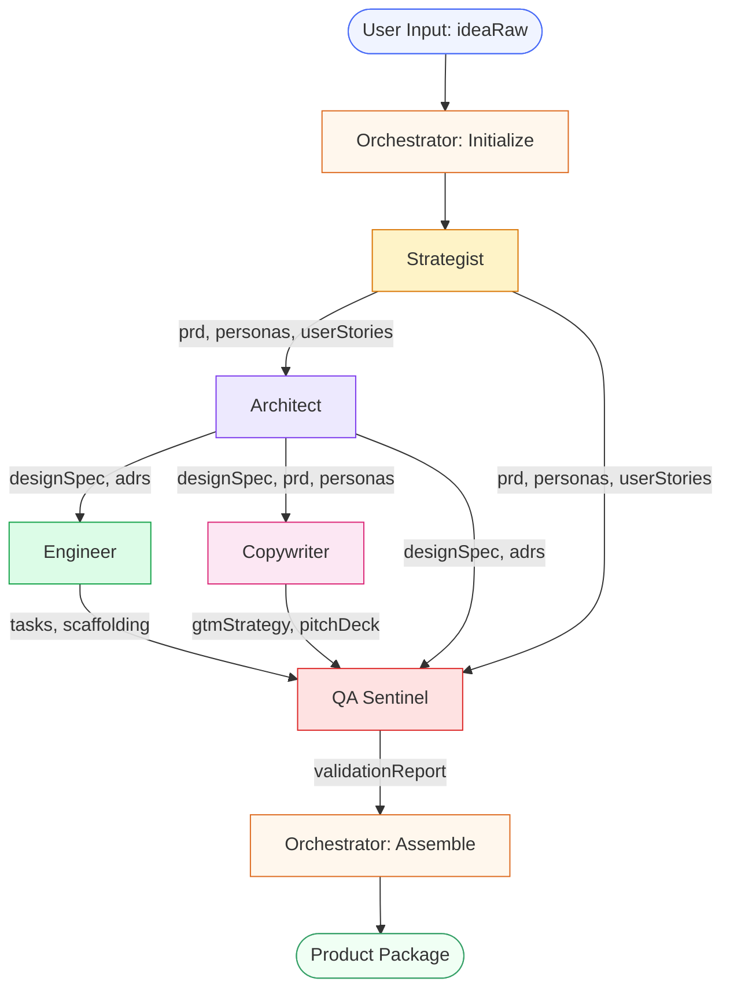
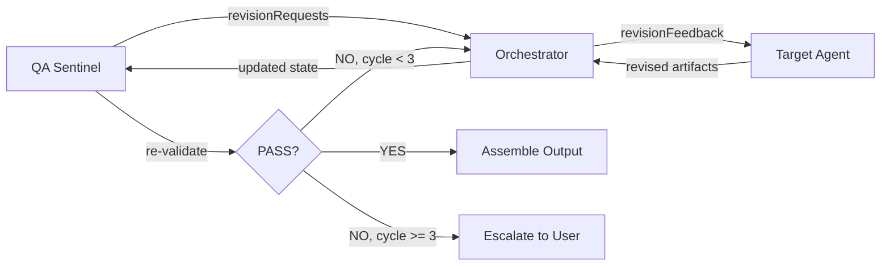

# SpecForge — DAG Execution Reference
**Version**: 1.0 | Date: 2026-03-02

---

## Overview
This document is the canonical reference for the SpecForge Directed Acyclic Graph (DAG) — the execution order, dependencies, and data contracts between all agents in the pipeline.

---

## Visual DAG



---

## Execution Phases

| Phase | Agents | Mode | Trigger |
|---|---|---|---|
| 0 | Orchestrator (init) | Sequential | User submits idea |
| 1 | Strategist | Sequential | Phase 0 complete |
| 2 | Architect | Sequential | Strategist complete |
| 3 | Engineer + Copywriter | **Parallel** | Architect complete |
| 4 | QA Sentinel | Sequential | Phase 3 complete |
| 5 | Orchestrator (assemble) | Sequential | QA Sentinel PASS/PASS_WITH_WARNINGS |

---

## Node Dependency Matrix

| Agent | Depends On | Produces | Consumed By |
|---|---|---|---|
| `orchestrator` | — | `state.json`, `OrchestrationPlan` | All agents |
| `strategist` | `orchestrator` | `prd.md`, `personas.md`, `user-stories.md` | `architect`, `copywriter`, `qa_sentinel` |
| `architect` | `strategist` | `adr-*.md`, `design-spec.md` | `engineer`, `copywriter`, `qa_sentinel` |
| `engineer` | `architect` | `tasks.json`, `tasks.md`, `scaffold/` | `qa_sentinel` |
| `copywriter` | `architect` | `gtm-strategy.md`, `pitch-deck.md` | `qa_sentinel` |
| `qa_sentinel` | `strategist`, `architect`, `engineer`, `copywriter` | `validation-report.md`, `validation-report.json` | `orchestrator` |

---

## Artifact Flow Map

```
ideaRaw
  └─► strategist
        ├─► prd.md ──────────────────────────────────────────► qa_sentinel
        │     └─► architect                                         ▲
        │           ├─► adr-001.md ... adr-00N.md ─────────────────┤
        │           └─► design-spec.md                              │
        │                 ├─► engineer                              │
        │                 │     ├─► tasks.json ────────────────────►│
        │                 │     ├─► tasks.md ──────────────────────►│
        │                 │     └─► scaffold/ ─────────────────────►│
        │                 └─► copywriter                            │
        │                       ├─► gtm-strategy.md ───────────────►│
        │                       └─► pitch-deck.md ─────────────────►│
        ├─► personas.md ─────────────────────────────────────────►  │
        └─► user-stories.md ──────────────────────────────────────► │
                                                                     │
                                                          validation-report.md
                                                          validation-report.json
                                                                     │
                                                                     ▼
                                                          orchestrator (assemble)
                                                                     │
                                                                     ▼
                                                          specforge-output/
                                                            ├─ README.md
                                                            └─ summary.md
```

---

## Revision Loop

When QA Sentinel returns `FAIL` or issues `revisionRequests`:



---

## State Transitions

```
ArtifactState.orchestrationPlan.pipelineStatus:

initializing ──► running ──► complete
                    │
                    └──► failed (on unrecoverable error)
                    └──► partial (on escalation to user)

DagNode.status per agent:

waiting ──► running ──► complete
               │
               └──► failed ──► (retry once) ──► complete | escalate
               └──► skipped (if dependency failed)
```

---

## Environment Variables Required

```env
# Orchestrator
SPECFORGE_RUN_TIMEOUT_MS=300000
SPECFORGE_MAX_REVISIONS=3
SPECFORGE_STATE_PATH=orchestrator/state.json

# GitHub Integration
GITHUB_TOKEN=
GITHUB_ORG=

# Complete.dev
COMPLETE_SPACE_ID=
COMPLETE_API_KEY=
```

---

## Error Codes

| Code | Description | Recovery |
|---|---|---|
| `E001` | Agent timeout (>120s) | Retry once, then escalate |
| `E002` | Artifact validation failed | Re-invoke with revisionFeedback |
| `E003` | Missing required input | Block pipeline, surface to user |
| `E004` | Circular dependency detected | Halt immediately, log DAG state |
| `E005` | Max revisions exceeded | Escalate to user with full report |
| `E006` | GitHub push failed | Store locally, warn user |
| `E007` | State persistence failed | Halt immediately, do not proceed |
