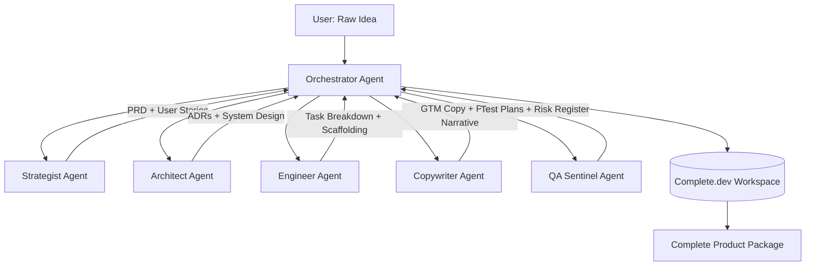

# Design Specification: SpecForge

## 1. Technical Summary
SpecForge is a self-assembling product engine built natively on Complete.dev. A user submits a raw idea; the Orchestrator agent sequences six specialized agents that collaboratively produce a complete product package — PRD, ADRs, design spec, task breakdown, GTM strategy, and pitch deck — stored as structured artifacts in the shared workspace.

## 2. Architecture Diagram



## 3. Layer Breakdown
- **UI**: Complete.dev chat interface — user submits idea, monitors agent progress, reviews artifacts
- **Orchestration**: Orchestrator agent manages DAG execution, artifact state, and agent routing
- **Agent Layer**: Six specialized agents with structured JSON input/output contracts
- **Storage**: Complete.dev shared workspace — all artifacts stored as Markdown + JSON files
- **Delivery**: GitHub repo scaffolded by Engineer agent; marketing site deployed via GitHub Pages

## 4. Business Logic and Data Flow

**Happy Path:**
1. User submits raw idea string
2. Orchestrator evaluates artifact state (empty) → invokes Strategist
3. Strategist produces PRD → stored in workspace → Orchestrator notified
4. Orchestrator invokes Architect with PRD → ADRs produced → stored
5. Orchestrator invokes Engineer + Copywriter in parallel (both depend only on PRD + ADRs)
6. Orchestrator invokes QA Sentinel with user stories + design spec
7. Orchestrator assembles final package → notifies user

**Alternative Path:**
- User provides partial artifacts (e.g., existing PRD) → Orchestrator skips Strategist, starts at Architect

**Exception Handling:**
- Agent produces incomplete output → Orchestrator re-invokes with clarification prompt
- Agent fails → Orchestrator flags gap, requests user input, continues with remaining agents

## 5. Layer-Specific Design

### 5.1. File Manifest

| File | Action | Owner Agent |
|---|---|---|
| `artifacts/prd.md` | Create | Strategist |
| `artifacts/personas.json` | Create | Strategist |
| `artifacts/user-stories.json` | Create | Strategist |
| `artifacts/adrs/` | Create (multiple) | Architect |
| `artifacts/design-spec.md` | Create | Architect |
| `artifacts/tasks.json` | Create | Engineer |
| `artifacts/scaffolding/` | Create | Engineer |
| `artifacts/gtm-strategy.md` | Create | Copywriter |
| `artifacts/pitch-deck.md` | Create | Copywriter |
| `artifacts/test-plan.md` | Create | QA Sentinel |
| `artifacts/risk-register.json` | Create | QA Sentinel |
| `orchestrator/state.json` | Create/Update | Orchestrator |

### 5.2. Public Interfaces and Types

```typescript
/**
 * The canonical artifact state tracked by the Orchestrator.
 */
interface ArtifactState {
  ideaRaw: string;
  prd?: Artifact;
  personas?: Artifact;
  userStories?: Artifact;
  adrs?: Artifact[];
  designSpec?: Artifact;
  tasks?: Artifact;
  gtmStrategy?: Artifact;
  pitchDeck?: Artifact;
  testPlan?: Artifact;
  riskRegister?: Artifact;
}

/**
 * A single produced artifact with metadata.
 */
interface Artifact {
  /** Unique artifact identifier */
  id: string;
  /** Producing agent name */
  producedBy: AgentName;
  /** ISO timestamp of production */
  timestamp: string;
  /** Workspace file path */
  filePath: string;
  /** Validation status */
  status: 'pending' | 'valid' | 'invalid' | 'needs_revision';
}

type AgentName = 'orchestrator' | 'strategist' | 'architect' | 'engineer' | 'copywriter' | 'qa_sentinel';
```

### 5.3. Public Functions

```typescript
/**
 * Entry point — accepts raw idea, initializes artifact state, begins orchestration.
 * @param idea - Raw user idea string
 * @returns Initial artifact state with orchestration plan
 */
async function initializeSpecForge(idea: string): Promise<ArtifactState>

/**
 * Evaluates current artifact state and returns next agent(s) to invoke.
 * @param state - Current artifact state
 * @returns Ordered list of agents to invoke next (supports parallel)
 */
function resolveNextAgents(state: ArtifactState): AgentName[]

/**
 * Validates an artifact against its expected schema.
 * @param artifact - The artifact to validate
 * @param schema - JSON schema for validation
 * @returns Validation result with error details if invalid
 */
function validateArtifact(artifact: Artifact, schema: object): ValidationResult
```

### 5.4. Refactor Cascade
- Any change to `ArtifactState` schema requires updates to Orchestrator routing logic and all agent output contracts
- Adding a new agent requires: new `AgentName` type entry, new `ArtifactState` field, new `resolveNextAgents` routing rule

## 6. Configuration Changes
- Complete.dev Agent Builder: six new agent configurations with system prompts
- GitHub Actions: workflow for scaffolding deployment on Engineer agent completion
- Environment: `GITHUB_TOKEN` for repo scaffolding

## 7. New Dependencies
- None beyond Complete.dev platform and GitHub

## 8. ADR Links
- [20260302-R-001]: SpecForge concept and approach
- [20260302-R-002]: Agent roster and responsibility boundaries  
- [20260302-R-003]: DAG orchestration pattern
